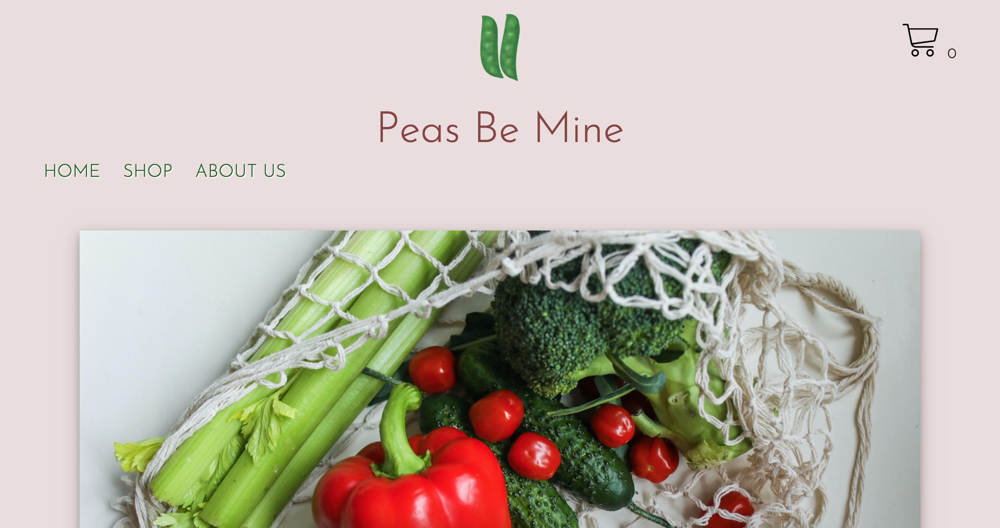

# Peas Be Mine

- Simple E-commerce Shop

## Description

Peas Be Mine is built with Next.js and PostgreSQL database. Cookies were set up using cookies-js and nextcookies libraries.

## Features

**Landing page** includes

- a header with logo, name and simple navigation
- a cart symbol shows the number of items put in the cart during shopping and also takes the user to the cart

**Shop** includes

- list of shopping items to browse from
- dynamic pages to show more details about the products and enable the user to add it to the cart and change quantity

**Cart** includes

- the total amount is available here
- the user can delete items from the cart or delete the whole list of items in the cart
- the checkout option asks the user to fill out a form after completion it directs to a thank you page

## Technologies used

- Next.js
- React.js
- TypeScript
- PostgreSQL and ley for database migrations
- emotion@core
- Deployment: Heroku

## Documentation

- ReadMe
- Design planning with Figma

## Screenshots

